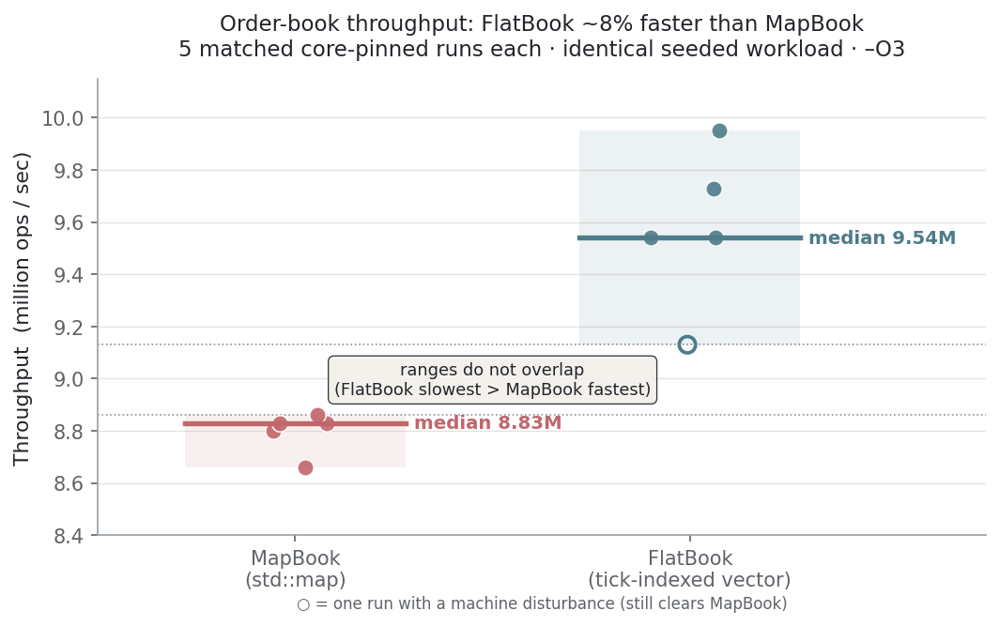

# orderbook-cpp
Limit order book and matching engine in C++20 with benchmarks. Has Price-Time Priority (FIFO), and supports adding, canceling and modifying orders. Price-level structure is toggleable between MapBook (map) and FlatBook (flat array) implementation.

## Build and Run
Requires a C++20 compiler (g++ or clang) and CMake 3.16+.

```bash
git clone https://github.com/cgryu/orderbook-cpp.git
cd orderbook-cpp
cmake -S . -B build -DCMAKE_BUILD_TYPE=Release
cmake --build build -j
./build/tests
./build/bench
```

## Design Decisions
- MapBook (map) and FlatBook (flat-array vectors) are implemented from the LevelBook Interface. The order processing and matching logic references only the LevelBook interface. The concrete implementation is selected at construction. Currently it is set to MapBook, swap to FlatBook by changing the one line and rebuilding.
- Time Priority is implemented via a std::list in PriceLevel, and a separate ID index; a list is used for iterator and reference stability during inserts/erases (a vector would fail at this), and the ID index holds a OrderLocation struct that holds the std::list iterator. Locating and removing an order (without erasing the level itself) is O(1).
- Modify maintains priority on an in-place quantity decrease and loses priority when a price changes or size increases (it follows the same logic as adding a new order).

## Benchmark Methodology
- Any RNG is seeded for consistency. This means that any generated workloads and their respective order streams and order operations will be identical across runs, regardless of FlatBook or MapBook usage.
- 10% of the workload is designated as untimed warmup to avoid cold cache allocation impacting measurement. Books are regenerated per pass so that no run is impacted by a previous run. The benchmark thread is core-pinned to avoid OS migration mid-run which may impact cache reloading and scheduler timing.
- Latency is reported as percentile to the nearest rank at the 50th, 95th and 99th percentile. This is done to characterize the entire distribution, rather than a simple average.
- To avoid false conclusions from single noisy runs, each book was run 5 times under identical core-pinned conditions; the median and range were compared across the two sets.

## Results
- FlatBook: Median 9.54M ops/sec, range 9.13-9.95M ops/sec
- MapBook: Median 8.83M ops/sec, range 8.66-8.86M ops/sec
- FlatBook shows a ~8% higher throughput, and the ranges do NOT overlap (FlatBook's slowest run is still more throughput than MapBook's fastest run).



- Latency is unchanged across data structures. Both books measured 100/200/300 ns at p50/p95/p99. This illustrates that the data structure change moves throughput, rather than per-op latency at the median or tail percentiles. (One exception occurs in one of the FlatBook runs which shows the measured latency percentiles as 100/400/800ns. This run showed a throughput dip and a cluster of slow operations not seen in any of the other four runs, and therefore will not be attributed to FlatBook, rather a machine disturbance)
- Absolute worst-case max latency generally ranged 3-4M ns across runs with some outliers between 10-17M ns and is primarily rare spikes. See additional tail analysis in section below for why these can be assumed to not be a MapBook vs FlatBook difference.

## Future Outlook / Open Questions
- All benchmarking was done with a single, relatively-shallowly generated workload. The actual depth of the book is at most 40 price levels with the current workload generator. It is also dense, which positively impacts FlatBook's performance as the rescan executed during an erase-best does not have to travel far. The following scenarios remain untested: a deeper book (Map's O(log L) grows while Flat's O(1) stays constant), and a wide and sparse book (which would cause the vector to waste memory on empty levels and take longer during the best-price rescan).
